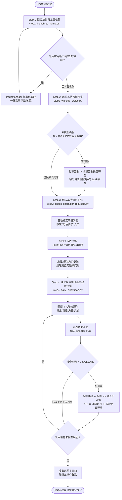

# SD Gundam Daily Operations & Verification Runbook

本手冊定義《SD 鋼彈 G 世代 永恆》已實機驗證之標準日常自動化維護流程、多模態驗證準則、異常彈窗標準化處置策略以及各單元調試指令。

---

## 0. 執行環境標準 (Prerequisite Environment - Mandatory)

- **唯一指定 Conda 環境**：**`sd_gundam`**
  - **環境路徑**：`C:\Users\sharkMeow\miniconda3\envs\sd_gundam`
  - **Python 直譯器**：`C:\Users\sharkMeow\miniconda3\envs\sd_gundam\python.exe`
  - **啟用指令**：`conda activate sd_gundam`
- **鐵律要求**：
  - 本手冊記載的所有調度指令、腳本測試、主流程執行，**一律嚴格在 `sd_gundam` Conda 環境中執行**。
  - 嚴禁使用 `base` 環境或散落之其他虛擬環境。已配置 `onnxruntime-directml` 支援 RTX 4070 SUPER GPU 加速。


---

## 1. 核心操作原則 (Core Principles)

1. **零盲試盲點原則 (No Blind Guesswork)**：
   - 嚴格遵守 `AGENTS.md`：進行任何操作前必須具備確定性畫面錨點或 YOLO 偵測邊界框。
   - 遇到不確定關卡或未知頁面，一律安全存檔並暫停向使用者請示。
2. **多模態狀態閉環 (Multi-Modal State-Driven Verification)**：
   - 嚴禁單純依靠布林回傳或單一高門檻模板（避免因光影動態導致信心度不足而誤判假陽性）。
   - 必須驗證「操作前狀態 $\rightarrow$ 點擊觸發 $\rightarrow$ 彈窗結算 $\rightarrow$ 操作後狀態變更（數值增長/計數歸零/按鈕灰暗）」之完整狀態轉移。
3. **集中式頁面管理 (Centralized PageManager)**：
   - 所有彈窗、換日、簽到與資料下載一律交由 `core/page_manager.py` 處理，拒絕各任務各自獨立私下點擊。
   - **最高指導原則：任何介面跳出資源/資料更新下載彈窗，一律自動點擊「下載」並等待完成**。

---

## 2. 標準化日常工作流 (Verified Daily Operations Workflow)



---

## 3. 分步操作詳解 (Detailed Step Runbooks)

### 🚀 Step 1: 遊戲啟動與主頁收斂
- **執行指令**：
  ```bash
  python scripts/step1_launch_to_home.py
  ```
- **核心邏輯**：
  1. 透過 ADB 啟動 `com.bandainamcoent.sdgundamge` 主 Activity。
  2. 推進健康免責警語（點擊螢幕中央）。
  3. 監聽並自動處理**資料更新/下載彈窗**（一律點擊「下載」並等待 8~12s）。
  4. 點擊標題畫面推進登入。
  5. 由 `PageManager` 自動關閉登入獎勵簽到、營運公告與每日換日彈窗。
  6. 以**三核心錨點多數決**（出擊按鈕、等級頭像框、AP體力條）驗證主頁完全載入。

---

### 🚢 Step 2: 個人基地戰艦巡航遠征領取
- **執行指令**：
  ```bash
  python scripts/step2_warship_cruise.py
  ```
- **多模態嚴格驗證準則**（防假陽性核心）：
  - **色彩通道檢驗**：按鈕中心座標 `(1676, 875)`
    - 可領取（Active 亮藍）：$B > 180$ 且 $R < 100$（實測 $B=253$）。
    - 已領取（Disabled 暗灰）：$B < 140$（實測 $B=111$）。
  - **RapidOCR 語意檢驗**：辨識右下區域文字包含「全部回收」。
  - **狀態轉移四重檢驗**：
    1. 點擊前記錄經過時間（如 `24小時8分`）與待領道具數量。
    2. 點擊 `(1676, 875)`。
    3. `PageManager` 捕捉「回收道具」彈窗並點擊 OK，同時捕捉日常成就提示（如「於戰艦巡航中獲得20AP」）。
    4. 彈窗關閉後驗證：經過時間重置為 **0分鐘**、待領道具數量變為 **$\times 0$**、按鈕轉為暗灰。
    5. 返回主頁驗證帳號 AP 實質增加。

---

### 🎖️ Step 3: 個人基地角色要求委託
- **執行指令**：
  ```bash
  python scripts/step3_check_character_requests.py
  ```
- **核心邏輯**：
  1. 從主頁進入「個人基地」。
  2. 若「角色要求」Banner 未在當前視野，執行平滑貝茲滑動向左探索：`swipe_bezier((1400, 540), (600, 540))`。
  3. 點擊進入角色要求 3-Slot 總覽介面。
  4. 依序巡檢 3 個卡槽（Slot 1~3）：
     - 透過 OCR 排除冷卻中（倒數計時）卡槽，針對有效卡槽進入詳情。
     - 解析委託品階（SSR/SR/R）、任務類型與進度。
     - 依任務類型標準策略處理（如交付機體、開發機體、放棄奪取等）；**若遇到不熟悉、未定義操作或未知任務，強制觸發安全防護並主動請示使用者，嚴禁盲點**。
  5. 點擊選中目標卡片進入詳情：
     - 若為未承接：點擊「承接」，若遇角色對話自動點擊右上「略過」。
     - 若為已達成：點擊「報告/領取」，由 `PageManager` 確認獎勵彈窗。
  6. 安全返回主頁。

---

### ⚔️ Step 4: 強化培育關卡最高難度掃蕩
- **執行指令**：
  ```bash
  python scripts/step4_daily_cultivation.py
  ```
- **核心邏輯**：
  1. 從主畫面點擊底欄「關卡」$\rightarrow$ 點擊「強化培育關卡」總覽卡片。
  2. 依序遍歷 4 大培育類別：
     - `CAPITAL`（資金）
     - `單位培育`（機體經驗/突破）
     - `角色培育`（駕駛員經驗/突破）
     - `支援人員培育`（艦長/通訊員經驗）
  3. 針對每一類別：
     - 平滑向下拉動列表置頂：`swipe_bezier((450, 450), (450, 750))`，確保最高難度（LV6）位於頂部第一張卡片。
     - 點擊頂部卡片選中 LV6 難度。
     - 檢查是否具備通關標記（CLEAR）且剩餘次數 $> 0$。若已為 0/5 則記錄略過。
     - 點擊「略過」（優先使用 YOLO `btn_skip`，校準兜底座標為 `(1673, 709)`）。
     - 點擊 `[>>]` 按鈕（校準座標為 `(1280, 445)`），自適應當前最大可掃蕩次數（適應活動雙倍或 5 次限制）。
     - 點擊「執行」（優先使用 YOLO `btn_confirm`，校準兜底座標為 `(1148, 850)`）。
     - 等待結算動畫（約 4 秒），由 `PageManager.handle_item_acquired()` 點擊 OK 領取。
     - 切換至下一分類標籤。
  4. 完成後調用 `fsm.navigate_to_home()` 自動安全收斂回主頁。

---

## 4. 全域例外與防護標準 (Global Exception Protocols)

### 4.1 資源更新與資料下載標準處置 (`handle_resource_download`)
- **觸發特徵**：OCR 文字含有「下載」/「下载」且包含「MB/GB/Wi-Fi/資料」等關鍵字。
- **標準動作**：
  - 鎖定「下載」按鈕（典型座標 `(1149, 850)`）。
  - 發送擬真點擊確認下載。
  - 等待 8.0 ~ 12.0 秒隨機延遲，確保進度條跑完並自動刷新頁面。

### 4.2 未知頁面安全阻斷守衛 (`PageType.UNKNOWN`)
- **觸發情境**：任何導航或流程中，出現非預期之全螢幕新介面或未登記之特殊活動。
- **標準動作**：
  1. 立即暫停任何點擊或滑動（絕不盲點盲試）。
  2. 自動將實機截圖儲存至 `captures/unknown_pages/` 並寫入 Log。
  3. 終端發出警報，主動退出或等待使用者指示由 Agent 介入協商。

---

## 5. Skill 執行呼叫指引 (Skill Execution & Invocation Guide)

> [!IMPORTANT]
> 執行以下任何指令前，**必須先啟用 Conda 專屬環境**：
> ```powershell
> conda activate sd_gundam
> ```
> 或使用絕對路徑直譯器：`& "C:\Users\sharkMeow\miniconda3\envs\sd_gundam\python.exe" <script.py>`

本 Skill 提供雙軌呼叫機制，AI Agent 或使用者可直接調用專屬執行器，或透過專案主進入點調用：

### 5.1 方式 A：透過 Skill 專屬執行器呼叫 (推薦)
Skill 目錄下內建指令調度器 [`scripts/run.py`](file:///d:/code/sd_gundam_script/.agents/skills/daily-operations-runbook/scripts/run.py)：

```bash
# 0. 確保環境已啟用
conda activate sd_gundam

# 1. 檢視當前狀態與畫面分類 (不發送操作，安全診斷)
python .agents/skills/daily-operations-runbook/scripts/run.py status

# 2. 執行 Step 1：遊戲啟動與主頁收斂
python .agents/skills/daily-operations-runbook/scripts/run.py launch
# 或別名：python .agents/skills/daily-operations-runbook/scripts/run.py step1

# 3. 執行 Step 2：戰艦巡航遠征領取 (多模態驗證)
python .agents/skills/daily-operations-runbook/scripts/run.py cruise
# 或別名：python .agents/skills/daily-operations-runbook/scripts/run.py step2

# 4. 執行 Step 3：個人基地角色委託 (SSR 優先)
python .agents/skills/daily-operations-runbook/scripts/run.py requests
# 或別名：python .agents/skills/daily-operations-runbook/scripts/run.py step3

# 5. 執行 Step 4：強化培育關卡最高難度 (LV6) 掃蕩
python .agents/skills/daily-operations-runbook/scripts/run.py cultivation
# 或別名：python .agents/skills/daily-operations-runbook/scripts/run.py step4

# 6. 一鍵執行完整日常管線 (Step 1 -> Step 4)
python .agents/skills/daily-operations-runbook/scripts/run.py all
```

### 5.2 方式 B：透過專案核心進入點呼叫
```bash
# 單一任務執行
python main.py --task launch       # 登入啟動
python main.py --task cruise       # 戰艦巡航
python main.py --task requests     # 角色要求
python main.py --task cultivation  # 培育關卡掃蕩

# 完整管線連續執行
python main.py --all
```

---

## 6. 品質保證與驗證指令集 (Verification & Quality Assurance)

在提交任何代碼修改或排程交付前，必須完整執行以下驗證清單：

```bash
# 1. 執行全專案語法編譯檢查 (必須 0 語法錯誤)
python -m compileall core tasks tools scripts tests

# 2. 執行全套單元測試 (必須全數通過，0 Failure / 0 Error)
python -m pytest

# 3. 實機單步流程驗證
python scripts/step1_launch_to_home.py
python scripts/step2_warship_cruise.py
python scripts/step3_check_character_requests.py
python scripts/step4_daily_cultivation.py
```
