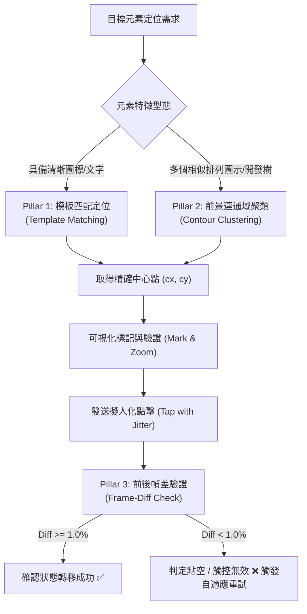

# Precise UI Locator Skill & Runbook

This skill establishes the engineering protocol for **deterministic UI element localization**, **visual verification**, and **click-state closed-loop validation** across all mobile game automation tasks.

---

## 0. 執行環境標準 (Runtime Environment Standard)

- **唯一指定 Conda 環境**：**`sd_gundam`** (`C:\Users\sharkMeow\miniconda3\envs\sd_gundam`)
- **環境啟用**：`conda activate sd_gundam`
- **鐵律要求**：所有視覺定位、模板截圖、檢查工具（`tools/inspector.py`、`tools/locator.py`）與測試必須於 `sd_gundam` 環境中執行，嚴禁使用 `base` 或其他環境。

---

## 1. Core Motivation & Problem Statement

### The "Eyeball Guesswork" Trap
Estimating `(x, y)` coordinates purely by visual mental arithmetic in 1920x1080 resolution is fundamentally flawed:
1. **Sidebar & Margin Offsets**: Dynamic collapsible sidebars, notch safe-areas, and letterbox paddings can shift targets by 200–400 pixels without visual warning.
2. **Blind Execution Failures**: Blindly sending `adb input tap x y` without validating whether the tap struck the actual element causes phantom clicks in empty space.
3. **No Closed-Loop Feedback**: If a click lands on static background instead of an interactive button, the bot assumes the action succeeded and gets permanently stuck.

---

## 2. The 3-Pillar Deterministic Localization Pipeline



---

## 3. Implementation Protocols

### Pillar 1: OpenCV Template Matching (Zero-Pixel Error)
Always crop a tight (excluding animated/translucent outer background) template and use `core.vision.Vision.match_template`:

```python
from core.vision import Vision

vision = Vision()
# Returns exact MatchResult(x, y, w, h, confidence)
match = vision.match_template(frame, "assets/buttons/btn_target.png", threshold=0.82)
if match:
    target_cx, target_cy = match.center
```

### Pillar 2: Foreground Clustering for Dense Grids / Tech Trees
When locating icons in dense arrays (such as the G-Generation Development Tree or Stage Lists), use `tools.locator.UILocator.detect_foreground_clusters`:

```python
from tools.locator import UILocator

# Search inside the tech-tree ROI, excluding background space
# NOTE: The ROI coords below are calibrated for the 1920x1080 Development Tree; adjust per target screen.
clusters = UILocator.detect_foreground_clusters(
    frame,
    roi=(360, 200, 1560, 750),
    min_size=(40, 40),
    max_size=(300, 300)
)
# Returns sorted list of bounding boxes [(x, y, w, h), ...]
```

### Pillar 3: Click-and-Diff Verification Guard & Semantic State Guard
Never fire-and-forget clicks on unknown or newly calibrated elements. Always verify state transition by comparing the screen before and after:

```python
import time
from tools.locator import UILocator

frame_before = device.screencap()
device.tap(target_x, target_y)
time.sleep(1.5)
frame_after = device.screencap()

is_effective, diff_pct = UILocator.verify_click_effect(
    frame_before,
    frame_after,
    min_diff_percent=1.0
)

if not is_effective:
    logger.error(f"Tap at ({target_x}, {target_y}) had no effect (diff={diff_pct:.2f}%). Re-evaluating...")
```

> [!WARNING]
> **適用限制與抗干擾原則**：
> 1. 在具備動態宇宙星空背景、粒子光效或按鈕呼吸燈的畫面中，環境像素波動容易使單純的 Frame Diff 產生偽陽性。
> 2. **推薦標準做法**：優先使用 `PageManager.classify()` 或 YOLO 邊界框狀態轉移（例如按鈕消失、彈窗浮現、數值變化）作為主導閉環驗證，Frame Diff 作為輔助檢驗。
> 3. **按鈕點擊原則**：靜態系統按鈕（NavBar、Back）採用 `NavigationCoords` 固定座標；動態按鈕強制由 CV / YOLO 辨識後點擊。若遇到未知或未定義操作，**強制規定停下向使用者請示，絕不盲點**。

---

## 4. Visual Debugging Standard Operating Procedure (SOP)

Whenever an agent or developer needs to inspect or verify a tap coordinate:
1. **Never guess**: Run `UILocator.mark_point()` to produce a 2x zoomed crop with crosshairs:
   ```python
   from tools.locator import UILocator

   UILocator.mark_point(
       frame,
       x=target_x,
       y=target_y,
       label="Target",
       save_marked_path="captures/temp/marked.png",
       save_zoom_path="captures/temp/zoom.png"
   )
   ```
2. **Inspect the Zoomed Artifact**: Open and review the zoom crop to guarantee the crosshair center hits the clickable interactive body.
