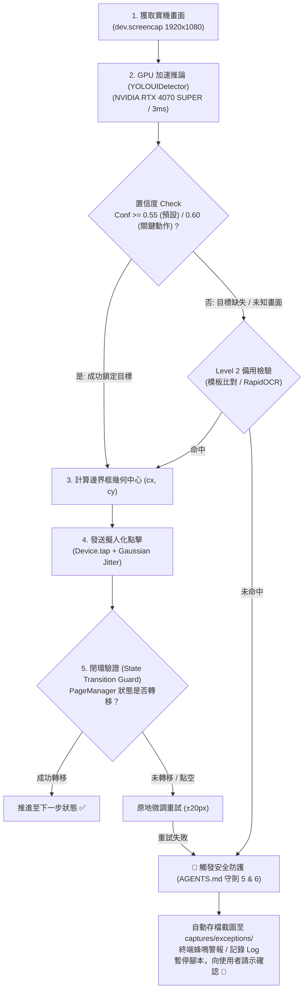

# YOLO UI Detection & Anti-Blind-Click Skill

This skill defines the engineering standard, runtime integration, and runbook for **deterministic, sub-millisecond game UI element localization** using **YOLO (v8 / v11 / ONNX DirectML)** accelerated by the local **NVIDIA GeForce RTX 4070 SUPER**, replacing mental coordinate guesswork and VLM hallucinations with exact bounding-box geometry.

---

## 0. 執行環境標準 (Runtime Execution Environment)

- **專屬 Conda 環境**：**`sd_gundam`** (`C:\Users\sharkMeow\miniconda3\envs\sd_gundam`)
- **環境啟用**：`conda activate sd_gundam`
- **GPU DirectML 依賴**：本環境已安裝 `onnxruntime-directml`，提供 `DmlExecutionProvider`，推論引擎將直接鎖定 **NVIDIA RTX 4070 SUPER** 運算。
- **嚴格規範**：禁止在 Conda `base` 或其他未配置 DirectML 之環境執行 YOLO 推論。

---

## 1. Core Engineering Motivation

### 🛑 徹底廢除「肉眼心算座標」與「盲點猜測」
手遊自動化中最嚴重的崩潰源自以下連鎖反應：
1. **空間坐標幻覺 (Hallucination)**：AI Agent 僅憑肉眼概估座標（如誤將機體算成空地 `(415, 450)`），導致點擊發送至空白宇宙背景。
2. **粒子動畫偽陽性 (Particle False-Positive)**：以全畫面像素差判定是否點擊成功時，遊戲呼吸燈或背景粒子動畫造成 `diff > 0` 誤判，腳本誤以為成功而盲目推進下一步。
3. **跨關卡佈局漂移 (Layout Drift)**：不同系列（W、SEED、UC 等）的開發樹機體排列不同，寫死座標必定破功。

### 🎯 YOLO 解決方案的技術優勢（RTX 4070 SUPER 實測）
- **超低延遲**：推論耗時僅 **2 ~ 5 毫秒**，完全不卡頓遊戲流程。
- **絕對確定性 (Determinism)**：輸出剛性邊界框 `[x1, y1, x2, y2]` 與置信度，絕無生成式語言模型的文字幻覺。
- **抗光影干擾**：卷積神經網路能精確辨識目標實體邊界，不受半透明底色或星空粒子干擾。

---

## 2. 系統架構與閉環工作流 (Architecture & Workflow)



---

## 3. UI 元素類別定義 (Class Taxonomy)

YOLO 模型針對 SD Gundam 遊戲介面收斂為以下核心類別：

| 類別名稱 (`class_name`) | 說明 | 典型出現位置 | 處理策略 |
|---|---|---|---|
| `btn_accept` | 承接按鈕（藍色） | 角色要求詳情右下 `(1623, 800)` | 點擊中心並略過對話 |
| `btn_challenge` | 挑戰按鈕（藍色） | 進行中要求右下 `(1623, 800)` | 點擊中心直達路線圖或關卡 |
| `btn_report` | 報告按鈕（橘色） | 完成要求右下 `(1623, 858)` | 點擊領取獎勵 |
| `btn_deliver` | 交付按鈕（橘色/藍色）| 交付彈窗右下 `(1160, 955)` | 點擊提交機體/資金 |
| `btn_confirm` | 確定 / 執行按鈕 | 各類確認彈窗 `(1148, 996)` | 點擊確認操作 |
| `btn_cancel` | 取消按鈕 | 各類取消操作 `(772, 995)` | 取消操作返回上一層 |
| `btn_skip` | 略過按鈕（右上/右下） | 故事對話 `(1768, 68)` / 掃蕩 `(1673, 709)` | 跳過劇情與掃蕩出擊 |
| `btn_trash` | 垃圾桶按鈕 | 角色要求詳情右上 `(1752, 182)` | 捨棄任務觸發 |
| `btn_close` | 關閉彈窗按鈕 | 各類資訊彈窗中央或右上 | 關閉資訊彈窗 |
| `unit_r` | 一階 R 機體實體 | 開發路線圖各分支起始節點 | 點擊本體打開生產介面 |
| `unit_sr` | 二階 SR 機體實體 | 開發路線圖中階節點 | 點擊本體或檢視狀態 |
| `unit_ssr` | 三階 SSR 機體實體 | 開發路線圖高階節點 | 點擊本體或檢視狀態 |
| `badge_rarity` | 機體階級標籤（R/SR/SSR）| 機體節點下方 | 作為幾何錨點計算 |
| `modal_card` | 浮動視窗主體 | 畫面中央 | 彈窗邊界定位 |
| *(待擴充)* `btn_tap_to_next` | 點擊推進提示 | 動畫播放與結算畫面 | 觸控畫面中央跳過 |

---

## 4. 腳本整合與按鈕策略規範 (Script Integration Runbook)

### 規則 1：固定按鈕優先固定座標，動態按鈕強制 CV (Fixed vs CV Policy)
- **固定系統按鈕**：NavBar 底部導航分頁（Home, Stages, Base 等）及頂部 Back 按鈕，版面幾何固定，**應優先使用 `NavigationCoords` 固定常數座標**。
- **動態按鈕與內容元件**：所有隨遊戲內容或狀態出現的按鈕（如承接、挑戰、報告、交付、確認、略過等），**強制必須透過 `YOLOUIDetector` 或其語意封裝器 `StateMachine.locate_and_tap_target()` 取得邊界框後才可點擊**。嚴禁在未辨識的情況下直接點擊猜測之裸座標！

### 規則 2：點擊前後閉環驗證 (Closed-Loop Guard)
點擊必須搭配 `PageManager` 驗證狀態是否發生實質轉移，杜絕「連鎖空點」：

```python
# 透過 StateMachine 提供的閉環點擊方法
success = self.fsm.tap_and_wait_transition(
    target_coords=target.center,
    expected_page=PageType.MODAL_CONFIRM,
    timeout=4.0
)
if not success:
    logger.error("點擊未促發預期介面轉移，立即中斷防止失控！")
    return False
```

### 規則 3：遇到未知/不熟悉開發流程強制請示 (Mandatory Consultation)
若遇到開發上不懂、不清楚具體操作步驟、或尚未實作之特殊任務流程（例如不知如何自動化強化部隊或掃蕩特定關卡），**強制規定必須停下來向使用者請教，嚴禁私自寫死假的完成邏輯（如直接 return True）或在實機上盲點摸索**！

---

## 5. 例外安全守則與人工 Agent 介入協議 (Human-in-the-Loop Guardrail)

符合 `AGENTS.md` 核心守則第 5 條與第 6 條：

### 🛑 自動觸發條件：
1. 目標類別置信度低於預設門檻（`< 0.55`），且備用 Level 2 模板/OCR 皆未命中。
2. 連續 2 次點擊後畫面狀態未發生跳轉。
3. `PageManager.classify` 判定為 `UNKNOWN` 頁面。
4. 遇到未定義或無法判定如何操作之業務任務。

### 🚨 處置標準程序 (SOP)：
1. **立即鎖定保護**：中斷任何後續 ADB 點擊指令，絕不在未知畫面上盲點。
2. **截圖存證**：自動將完整高解析度畫面存至 `captures/exceptions/exception_YYYYMMDD_HHMMSS.png`。
3. **終端告警**：輸出清晰結構化資訊，包含當前狀態機狀態、已嘗試動作與影像路徑。
4. **主動請示交回主控權**：暫停並主動向使用者請教標準處理方式：
   > 「發現未知異常畫面或未實作之任務流程，系統已安全停機存檔於 `captures/exceptions/...`。請向使用者請教處理方式，絕不盲點盲試。」

---

## 6. 資料集建立與 RTX 4070 SUPER 訓練指南

專案已內建全自動工具集，支援一鍵準備與訓練：

### 步驟 1：收集實機樣本
```bash
python tools/dataset_builder.py
```
* 自動掃描 `captures/` 目錄，將候選畫面整理至 `datasets/gundam_ui/raw_to_label/`。

### 步驟 2：標註資料 (Labeling)
* 使用 [Labelme](https://github.com/wkentaro/labelme) 或 [AnyLabeling](https://github.com/CVHub520/X-AnyLabeling) 開啟 `raw_to_label/`，依據第 3 節類別框選標籤，輸出成 YOLO 格式存於 `datasets/gundam_ui/labels/train/`。

### 步驟 3：在 RTX 4070 SUPER 上微調訓練
```python
from ultralytics import YOLO

# 載入 YOLOv11-nano 預訓練權重
model = YOLO("yolo11n.pt")

# 利用 RTX 4070 SUPER 進行極速微調 (約需 3 分鐘)
model.train(
    data="datasets/gundam_ui/data.yaml",
    epochs=50,
    imgsz=640,
    batch=16,
    device=0  # 指定 RTX 4070 SUPER
)

# 匯出為 ONNX 格式以供 DirectML 高性能推論
model.export(format="onnx")
```
* 訓練完成後將 `best.onnx` 複製至 `models/yolo11n_ui.onnx`，系統將自動無縫切換為純 GPU 深度學習檢測模式！
