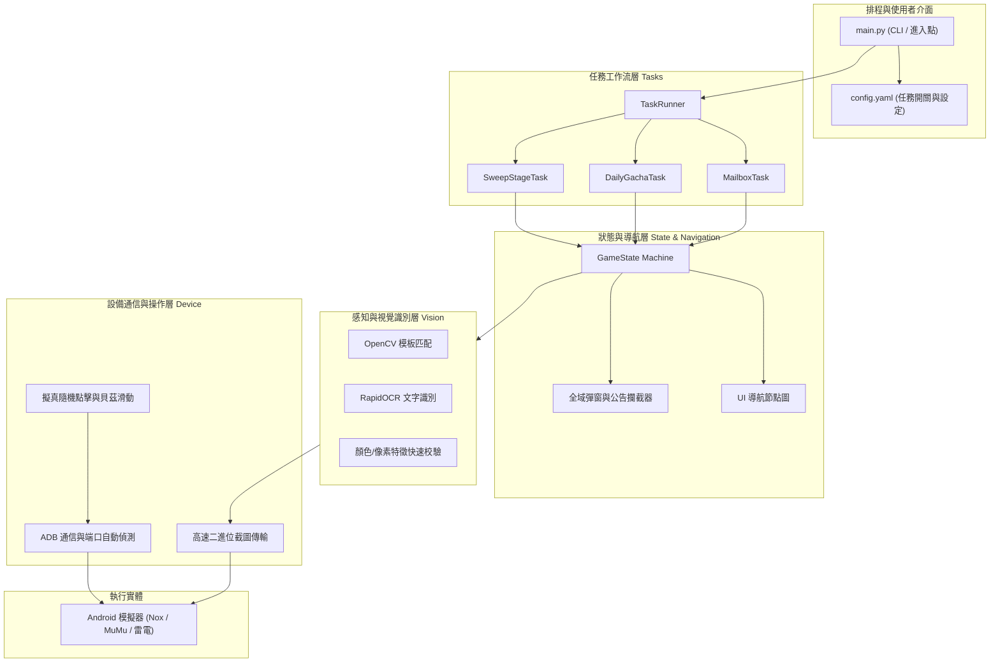

# 軟體架構設計手冊 (Software Architecture)

本文件詳述《SD 鋼彈 G 世代 永恆》自動化日常任務腳本的系統架構與設計哲學。

---

## 1. 設計哲學

1. **黑盒非侵入式 (Non-invasive Black-box)**：
   絕不讀寫遊戲記憶體、不攔截竄改網路封包，只透過模擬玩家視覺（螢幕截圖）與操作（觸控點擊、滑動）進行自動化，杜絕封號風險。
2. **狀態驅動 (State-Driven Navigation)**：
   捨棄脆弱的固定時間延遲（`time.sleep()`），改以畫面特徵錨點（Anchor Point）與狀態機導航，具備高度抗網路波動與畫面載入延遲能力。
3. **人類操作擬真 (Human-like Simulation)**：
   點擊座標採高斯亂數偏移、滑動採貝茲曲線非線性軌跡、操作間隔帶有動態隨機擾動，消除機器人特徵。
4. **模組化任務插拔 (Pluggable Task Pipeline)**：
   所有日常任務（領信箱、抽卡、掃蕩副本、領任務成就）皆繼承自標準介面，可獨立啟用、關閉或排序。

---

## 2. 系統架構圖 (Architecture Diagram)

---

## 3. 分層職責詳細說明

### 3.1 設備通信層 (`core/device.py`)
- **ADB 連線管理**：支援自動掃描本機常見模擬器端口（Nox `62001`, MuMu `16384`, LDPlayer `5555`）。
- **高速截圖**：透過 `adb exec-out screencap -p` 建立 Memory Stream，避開磁碟 I/O，截圖耗時壓在 100ms 內。
- **擬真輸入 (Human Input)**：
  - 點擊目標範圍內自動產生邊緣內縮安全區，計算隨機座標偏移。
  - 滑動操作產生隨機控制點之二次/三次貝茲曲線，以階梯式時間插值執行。

### 3.2 感知層 (`core/vision.py`)
- **模板比對 (Template Matching)**：
  - 採用 `cv2.TM_CCOEFF_NORMED` 進行正規化相關性係數匹配。
  - 支援動態指定匹配閾值（Threshold），回傳符合目標的中心座標與外框。
- **文字辨識 (OCR)**：
  - 使用 `rapidocr-onnxruntime`，具備極輕量、啟動零延遲、無需複雜 GPU 環境之優勢。
  - 用於掃蕩次數、體力數值、特定按鈕文字辨識。

### 3.3 狀態導航與異常自癒 (`core/state_machine.py`)
- **主畫面三大核心錨點 (Home Screen 3-Anchor Verification)**：
  為避免單一圖標受到活動 Banner 或半透明彈窗干擾，系統實作三錨點多數決投票機制（Multi-Anchor Voting）：
  1. **畫面右下角**：核心「出擊」按鈕 (`home_sortie.png`, ROI: `(1450, 850, 470, 230)`)，權重最高。
  2. **畫面左上角**：玩家等級數值與頭像框 (`home_level.png`, ROI: `(0, 0, 400, 160)`)。
  3. **畫面右上角**：AP 體力條與貨幣欄位 (`home_stamina.png`, ROI: `(1200, 0, 720, 160)`)。
  只有在彈窗完全關閉時，這三大錨點才會同時無遮蔽呈現，保證 100% 準確率。
- **全域彈窗守衛 (Global Popup Guard)**：在執行任何任務動作前，預先掃描畫面是否有「登入獎勵簽到」、「營運公告 X 關閉」、「今日不再提示」、「連線逾時重試」等擾亂元素，一律優先清理。

- **超時自癒 (Auto-Recovery)**：若特定狀態停留超過 30 秒，自動觸發 Android 實體返回鍵嘗試回到上一層，直至重新鎖定主頁錨點。

### 3.4 標準化頁面管理與例外處理 (`core/page_manager.py`)
- **頁面標準分類器 (`classify()`)**：
  - 透過 OCR 關鍵字與特徵錨點將當前畫面統一分類（如 `HOME`、`DATE_RESET`、`LOGIN_BONUS`、`MODAL_INFO`、`MODAL_CONFIRM`、`COMM_ERROR`、`TITLE_SCREEN`、`ITEM_ACQUIRED`）。
  - 各畫面具備獨立標準 Handler（如 `handle_date_reset`, `handle_login_bonus`, `handle_modal_info` 等），拒絕各任務私下自行盲猜處理。
- **未知頁面安全防護 (Unknown Page Guardrail)**：
  - 偵測到未定義或異常頁面（`UNKNOWN`）時，自動儲存截圖至 `captures/unknown_pages/` 並寫入 `unknown_pages_log.json`。
  - 發出終端警報並主動提示向使用者請教處理方針，落實 Human-in-the-loop 安全防護。

### 3.5 任務層 (`tasks/`)
- 統一介面 `BaseTask`：
  - `run() -> bool`：任務主執行邏輯。
  - `pre_check() -> bool`：任務前置檢查（如體力是否充足、次數是否已歸零）。
  - `post_check() -> bool`：任務成功後之狀態復原與領取驗證。
